# UI模板组件概述 #

## 业务需求 ##

在SAAS服务研发过程中，业务部门需要快速开发基于业务模型的WEB界面，并且运行期的界面支持按照用户或者租户的需求进行定制和个性化。因此业务部门需要一套基于业务模型、在线可视化设计、动态编译和发布前端资源、运行时引擎支撑、租户隔离的完整解决方案。


##解决方案##
iUAP中的UI模板是针对上述业务需求而设计一个大型组件，首先UI模板提供可视化的模板设计器界面，其次提供一套可以解析业务模型、编译落地前端HTML和JS资源、动态发布前端资源、支撑运行时交互API、支持多租户、支持模板动态查询的服务和SDK，并且UI模板可以独立于业务系统单独部署集成；


## 功能说明 ##

1.  UI模板设计器是一个在线单页应用，做为模板设计的入口；
2.  模板模型，是模板的描述模型，主要包括布局、业务对象关联、控件属性信息；
3.  参照控件，支持注册自定义参照，支持在模板中引用和设置参照信息；
4.  丰富的模板文件，并且可扩展控件宏文件；
5.  动态发布模板资源文件，支持前后端单独部署；
6.  丰富的运行时API，如后端业务基于模板模型进行VO转JSON，JSON转VO的API方法；
7.  支持无租户，集中数据，隔离数据三种租户方案；
8.  支持在线定制租户级模板；
9.  默认适配元数据模型；


# 整体设计 #

## 依赖环境 ##

模板组件采用Maven进行编译和打包发布，在http://maven.yonyou.com网站上可以下载，其对外提供的依赖方式如下：
```
模板完整war包：
    <dependency>
      <groupId>com.yonyou.iuap</groupId>
      <artifactId>uitemplate_web</artifactId>
      <version>${iuap.modules.version}</version>
      <type>war</type>
    </dependency>

模板运行时SDK jar包：
    <dependency>
      <groupId>com.yonyou.iuap</groupId>
      <artifactId>uitemplate_rt</artifactId>
      <version>${iuap.modules.version}</version>
      <classifier>classes</classifier>
    </dependency>

参照运行时SDK jar包：
    <dependency>
      <groupId>iuap.cloudform</groupId>
      <artifactId>uitemplate_ref</artifactId>
      <version>${iuap.modules.version}</version>
      <classifier>classes</classifier>
    </dependency>

${iuap.modules.version} 为平台在maven私服上发布的组件的version
```

## 开发流程说明 ##
UI模板主要开发过程包括业务对象模型设计、设计器界面设计、注册模板模型关联信息、编译和发布模板资源、运行时引擎；

1.  按照业务对象模型结构预制模型信息；
2.  业务开发人员通过业务模型快速新增模板，通过UI模板设计器URL指定业务模型ID；
3.  模板设计器读取模型信息并按照树形结构在设计器左侧展现出来；
4.  开发人员根据业务需求拖拽业务属性或者UI控件设计器web模板；
5.  调整UI模板的控件布局和控件属性，然后保存新增的模板模型，在uitemplate_temp表中根据模板name字段记录通过设计器保存后的模板模型主键pk_temp；
6.  把pkt_temp在模板关联表uitemplate_nexus_base中建立模板和业务节点的关联关系；
7.  编写业务节点前端代码，包括HTML和JS，节点控制器中通过templetUtils.js查询设计器好的的模板并在页面指定位置初始化模板；


# 使用说明 #

## 开发步骤 ##

下面详细讲解UI模板的安装，部署和开发过程：

### 模板单独部署说明 ###

1.  在用友maven库中下载uitemplate_web产品war包;
2.  解压部署到服务器目录下，应用名称叫uitemplate_web;
3.  数据源和redis缓存配置文件：\WEB-INF\conf\uitemplate\datasource.properties;
4.  根据需要配置模板环境：\WEB-INF\conf\uitemplate\uitemplate.properties;
5.  在用友maven中取最新的uui放在和uitemplate_web同目录下;
6.  日志配置文件\WEB-INF\conf\log-conf\logback.xml中指定日志目录； 
7.  在用友maven库中下载iuap_design产品,并部署到服务器中，应用名称叫uui；

### 执行数据库脚本 ###

初始化自己的数据库，然后依次执行uitemplate_web中setup目录下【模板和组件建库脚本.sql】和【模板预制参照的数据.sql】，导入模板的表结构和预制数据；

### 模板集成配置说明 ###

模板配置目录在WEB-INF\conf下面：

<table>
  <tr>
    <th>配置目录</th>
    <th>配置说明</th>
  </tr>
  <tr>
    <td>\log-conf</td>
    <td>日志配置目录，模板使用slf4j接口，支持logback、log4j等主流日志框架</td>
  </tr>
    <tr>
    <td>\mybatis</td>
    <td>持久层配置框架，模板本身通过mybatis框架实现</td>
  </tr>
   <tr>
    <td>\springconfig</td>
    <td>spring配置目录，包括模板应用配置和MVC配置</td>
  </tr>
 <tr>
    <td>\uitemplate</td>
    <td>模板集成配置目录，包括数据源、分布式缓存、参照实现服务地址、编译发布目录等扩展配置</td>
  </tr>
</table>

业务系统主要会用到\uitemplate目录下的配置文件，其中datasource.properties数据源配置文件，参数如下：

<table>
  <tr>
    <th>参数</th>
     <th>参数说明</th>
    <th>参数值举例</th>
  </tr>
  <tr>
    <td>jdbc.url</td>
    <td>模板数据源链接信息</td>
    <td>jdbc:mysql://20.12.6.84:3306/uitemplate?useUnicode=true&characterEncoding=utf-8</td>
  </tr>
    <tr>
    <td>redis.hostName</td>
     <td>分布式缓存redis地址</td>
    <td>127.0.0.1</td>
  </tr>
   <tr>
   <td>redis.port</td>
   <td>分布式缓存redis端口</td>
   <td>6379</td>
  </tr>
</table>


uitemplate.properties模板配置文件，参数如下：

<table>
  <tr>
    <th>参数</th>
     <th>参数说明</th>
    <th>参数值举例</th>
  </tr>
  <tr>
    <td>refctx</td>
    <td>业务实现参照服务的地址</td>
    <td>http://127.0.0.1:8080</td>
  </tr>
    <tr>
    <td>uitemplate_serverlocation</td>
     <td>模板后端服务目录</td>
    <td>windows：E:/tools/apache-tomcat-7.0.67/wtpwebapps/uitemplate_web;
    linux：/usr/local/apache-tomcat-8.0.30/webapps/uitemplate_web/</td>
  </tr>
   <tr>
   <td>uitemplate_webcontext_location_type</td>
   <td>模板编译目录地址类型</td>
   <td>1=本地（默认）；2=远端；3=FTP</td>
  </tr>
  <tr>
   <td>uitemplate_webcontext_location</td>
   <td>模板编译目录</td>
   <td>和模板编译目录地址类型配套使用，例如发布到tomcat服务器的demobill目录上，E:/tools/apache-tomcat-7.0.67/wtpwebapps/demobill</td>
  </tr>
   <tr>
   <td>ftp_ip、ftp_user、ftp_ps、ftp_port</td>
   <td>ftp服务链接配置信息</td>
   <td>标准ftp链接</td>
  </tr>
   <tr>
   <td>cacheType</td>
   <td>模板缓存类型</td>
   <td>1=Map（默认）；2=redis</td>
  </tr>
  <tr>
   <td>temp_macro_ext</td>
   <td>扩展模板宏文件目录</td>
   <td>例：1，绝对目录 "file:C:/test.dat"；2，类路径 "classpath:test.dat"；3，相对目录 "WEB-INF/test.dat"，注：扩展宏控件时需要保证跟被扩展目录一致</td>
  </tr>
   <tr>
   <td>require_config</td>
   <td>前端头文件配置方式</td>
   <td>用于扩展配置require.config的配置，默认设置true，引入相关的配置文件，false为节点配置引用</td>
  </tr>
</table>


### 示例开发节点---人员基本信息 ###

参照HR云产品的人员基本信息节点为例详细讲解模板的开发过程：

#### 设计人员信息元数据  ####

通过studio开发插件工具设计元数据
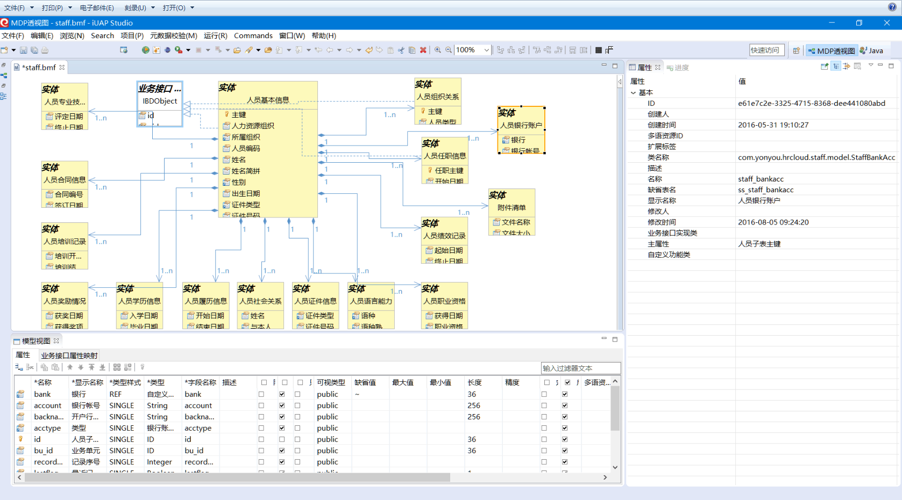
发布到数据库中，并且以组件的形式后端提供元数据同步接口服务，主要任务同步元数据到业务对象，用于模板前段设计加载业务对象生成业务对象树


#### 在线设计人员信息模板  ####

##### 1.人员信息模板整体概述 #####

在浏览器输入网址：http://ip:port/uitemplate_web/?md_component_id=05abcdf6-01bc-4a0f-b15c-eec52c6ba326打开人员信息模板页面（见图1），其中，05abcdf6-01bc-4a0f-b15c-eec52c6ba326对应相应的元数据id。人员信息模板布局如下图所示，分为左、中、右布局，左侧主要是根据元数据同步接口服务生成的业务对象树区域和普通控件区域；中间是模板操作、展示区域；右侧的表单设置区域可填写信息模板名称和描述字段，控件设置区域显示和设置中间区域中选中控件的相关属性。保存按钮保存设计好的人员信息模板并跳转到模板修改页面（见图2）；预览按钮可以预览当前设计的模板在运行时样式（见图3）。

图1：人员信息模板设计页面
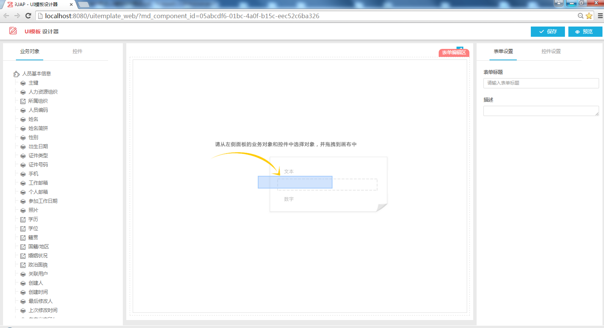

图2：人员信息模板修改页面
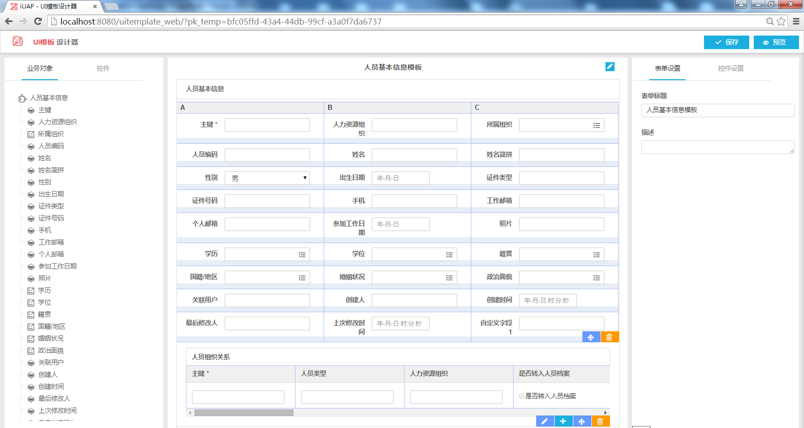

图3：人员信息模板预览页面
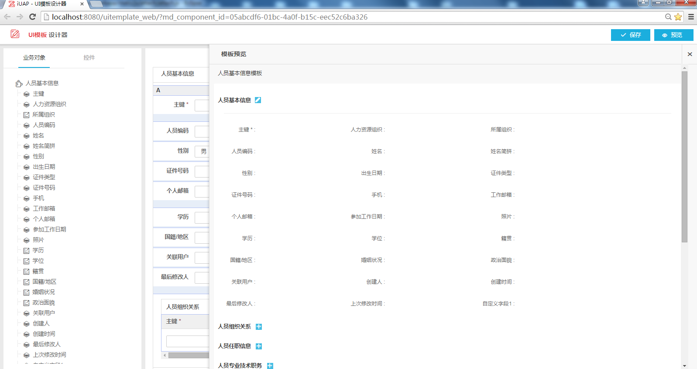

##### 2.使用常用布局和控件设计模板 #####

设计器提供了5种常用布局（见图4）和9种常用控件（见图5）方便设计者自己设计模板。通过鼠标拖拽将布局和控件拖拽到中间区域生成模板（见图6）。

图4：常用布局


图5：常用控件
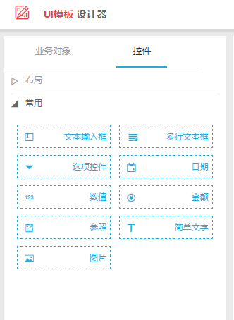

图6：使用布局和常用控件设计的模板
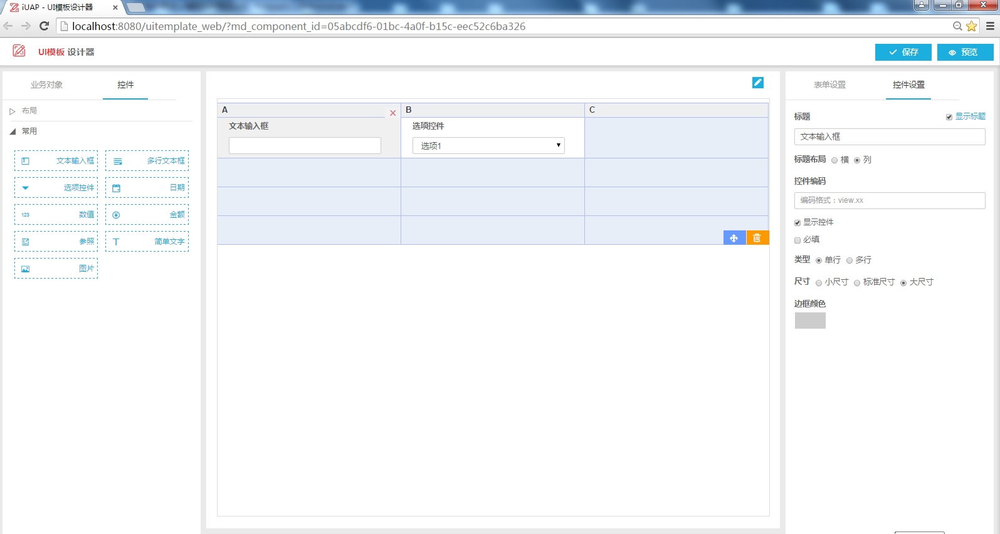

##### 3.使用业务对象树生成设计模板 #####

可以通过元数据同步接口服务生成的业务对象树快速生成想要的模板，图7就是直接拖拽根节点（人员基本信息节点）快速生成模板的例子；也可以单独拖拽叶子节点（如主键）或是子表（人员组织关系）生成模板。
使用业务对象树生成模板也提供在拖拽过程中重新设置业务对象的功能（见图7），可以在业务对象设置表中修改节点名称、控件类型、控件在运行态是否隐藏以及节点间排序。点击确定按钮则按新的设置生成模板，点击取消按钮则取消之前所有设置按照默认业务对象树生成模板。

图7：业务对象树快速生成模板


图8：业务对象设置表
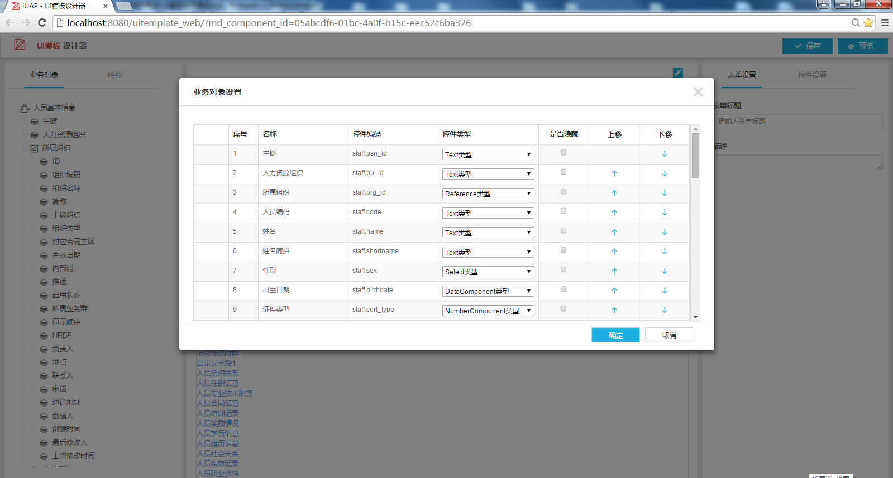

##### 4.控件设置 #####

点击中间区域任一控件，右侧控件设置区域显示此控件的相关属性信息，可以进行重新设置。各属性详细介绍如下（各控件间重复属性只说明一次）：

（1）文本输入框、多行文本框控件（见图9）
1.  标题：修改控件标题信息;
2.  显示标题：是否在运行态显示标题，默认显示;
3.  标题布局：设置标题和输入框是横向排列还是纵向排列;
4.  控件编码：如果是业务对象树节点则显示已经设置好的控件编码（元数据设置属性），如果是拖拽的常用控件，可以设置控件编码，设置的控件编码需以view开头，格式符合view.XXX;
5.  控件类型：只针对业务对象树节点，可以修改控件类型;
6.  显示控件：该控件在运行态是否显示；
7.  必填：如果勾选在设计态标题有星标识，运行态此控件不能为空；
8.  类型（单行、多行）：此属性只针对文本输入框和多行文本输入框控件，单行对应文本输入框，多行对应多行文本输入框；
9.  尺寸：设置控件尺寸，分小尺寸、标准尺寸和大尺寸3种；
10.  边框颜色：设置运行态编辑时的输入框颜色；

图9：文本输入框控件设置
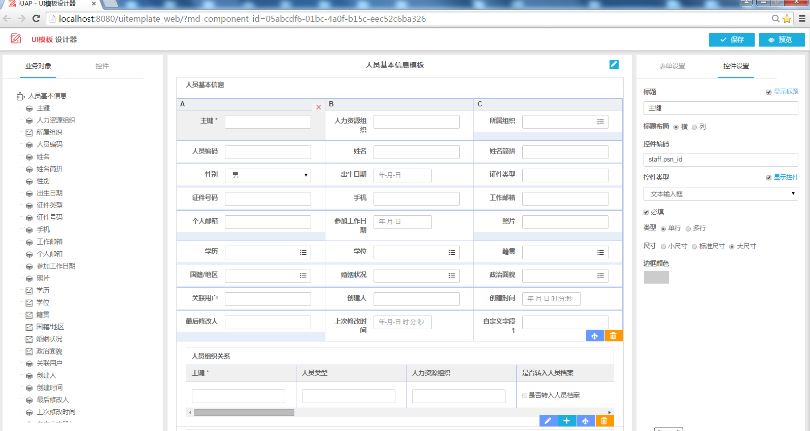

（2）选项控件（见图10，图11）
1.  类型：设置下拉控件类型，有单选框、多选框和下拉列表3种类型可切换；
2.  选项设置：设置选项，可点击批量编辑按钮编辑各选项；

图10：选项控件
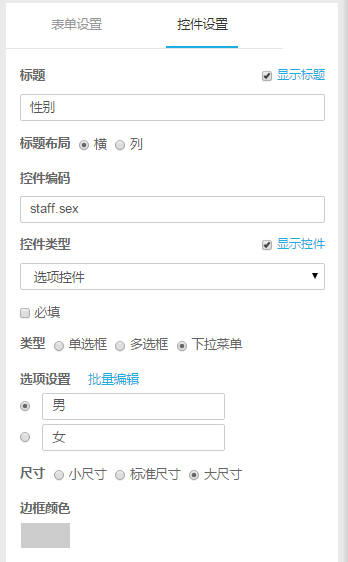

图11：选项控件批量编辑对话框
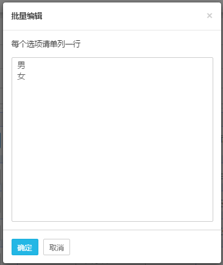

（3）日期控件（见图10）
1.  显示格式：设置日期格式，分为年-月、年-月-日、年-月-日 时:分、年-月-日 时:分:秒4种显示格式；
2.  默认值为系统日期：勾选则运行态显示当前系统日期；

图12：日期控件


（4）数值控件（见图10）
1.  小数：设置小数位数，范围0-8位；
2.  计算：如果勾选，设计态取值等于的下拉列表中显示此控件所在表中其他数值控件的名称和常量选项；运行态只读不能修改，显示选中的关联字段的值或是设置的常量值；

图13：数值控件

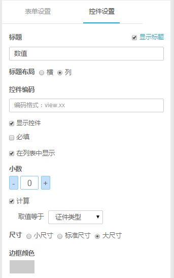

（5）金额控件（见图10）
1.  小数：设置小数位数，范围0-2位；
2.  选择货币：选择货币类型；
3.  转换成大写金额：如果勾选，运行态金额转成大写形式；

图14：金额控件

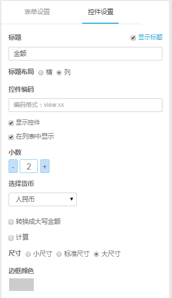

（6）参照控件（见图10）
1.参照列表：如果是普通控件就显示所有参照值，如果是业务对象树控件显示此控件关联的参照值；

图15：参照控件


#### 数据库中注册人员信息模板  ####
针对不同行业不同租户预制模板关联信息，租户初始化时会从系统表根据租户的行业地区信息导入到租户表中，然后运行时，就是通过功能号，标识查询相关模板；人员节点的系统模板关联数据如下：

<table>
   <tr>
        <th>字段</th>
        <th>值</th>
        <th>说明</th>
    </tr>
    <tr>
        <td>pk_nexus</td>
        <td>1</td>
        <td>主键，唯一标识</td>
    </tr>
    <tr>
        <td>pk_temp</td>
        <td>411273f5-ddfb-437e-b24b-7097ec64dca9</td>
        <td>模板主键，通过在线模板设计器生成</td>
    </tr>
    <tr>
        <td>nexuskey</td>
        <td>psn</td>
        <td>模板别名，分配标识，区分同意funnode下的不同模板</td>
    </tr>
    <tr>
        <td>funnode</td>
        <td>001PSN_TEST</td>
        <td>功能节点标识</td>
    </tr>
    <tr>
        <td>pk_country</td>
        <td>空</td>
        <td>国家地区标识</td>
    </tr>
    <tr>
        <td>pk_industry</td>
        <td>空</td>
        <td>行业标识</td>
    </tr>
    <tr>
        <td>layer</td>
        <td>空</td>
        <td>研发层次</td>
    </tr>
    <tr>
        <td>moduleid</td>
        <td>空</td>
        <td>模块</td>
    </tr>
    <tr>
        <td>ts</td>
        <td>2016-04-22 15:15:08</td>
        <td>模板更新时间</td>
    </tr>
</table>


#### 人员节点前端开发 ####

模板前端结构

<table>
    <tr>
        <th>结构</th>
        <th>说明</th>
        <th>备注</th>
    </tr>
    <tr>
        <td>模板文件uitemplate.html</td>
        <td>模板文件入口，引入相关css，js</td>
        <td>其中根据设计态模板，运行态中涉及很多宏控件，如表格table.html，表单form.html，grid.html等很多独立控件</td>
    </tr>
    <tr>
        <td>uitemplate.js，config.html</td>
        <td>uitemplate.js中引入相关配置文件config.html</td>
        <td>config.html配置文件可以被开发人员覆盖</td>
    </tr>
    <tr>
        <td>style.css，ifonfont.css，form-runtime.css，template.css</td>
        <td>ifonfont.css：图标样式   form-runtime.css：运行态样式  template.css：模板扩展样式</td>
        <td>引入顺序style.css->ifonfont.css->form-runtime.css->template.css</td>
    </tr>
    <tr>
        <td>form.html宏控件</td>
        <td>绘制form表单</td>
        <td>控件中有两个特别div的区域，id为form_before_picture和form_after_picture，每个div区域都绑定datatableid和entityid属性，用于回写绘制曲线图，这篇区域也可以用于绘制其它相关的片段</td>
    </tr>
    <tr>
        <td>templateUIManager.js</td>
        <td>控制界面UI变化处理</td>
        <td>修改按钮显示状态、按钮文本内容、处理图片显示、控件的非空校验</td>
    </tr>
    <tr>
        <td>templateModel.js</td>
        <td>模板模型数据处理</td>
        <td>数据初始化、行数据更新、数据清除、数据获取</td>
    </tr>
    <tr>
        <td>bodyFormListener.js</td>
        <td>子表form行点击监听事件处理</td>
        <td>处理行点击后form的相关显示</td>
    </tr>
    <tr>
        <td>templateutil.js</td>
        <td>模板查询工具类</td>
        <td>通过initTemplateComponent方法，设置templateComponentName、nexuskey、funcnode参数获取模板，生成静态文件，加载绑定到对应的div区域</td>
    </tr>
</table>
开发相关html，引入相关的css文件，在html中定义一个div，设置id区域以供模板加载，在相关节点(最好是在同级目录下添加文件，如uitemplate/controller.js)业务控制类controller.js处理业务逻辑controller.js可回调业务的方法;

<table>
    <tr>
        <th>回调方法</th>
        <th>说明</th>
    </tr>
    <tr>
        <td>extendViewModel</td>
        <td>扩展viewModel模型</td>
    </tr>
    <tr>
        <td>beforeInit</td>
        <td>数据加载前初始化业务逻辑</td>
    </tr>
    <tr>
        <td>init</td>
        <td>回调业务的viewModel的扩展</td>
    </tr>
    <tr>
        <td>afterInit</td>
        <td>业务数据初始化回调，主要处理数据加载，可调用templateModel.js中的init加载数据</td>
    </tr>
    <tr>
        <td>valchange</td>
        <td>业务数据回调处理，监听数据变化，计算金额合计</td>
    </tr>
    <tr>
        <td>其它相关操作</td>
        <td>add(新增)、del(删除)、edit(编辑)、headEdit(表头编辑)、save(保存)、cancel(取消)、rowEdit(子表行编辑)、rowDelete(子表行删除)相关业务回调</td>
    </tr>
</table>
加载模板，将生成的静态页面加载到相关的div区域，运行态效果如下图所示

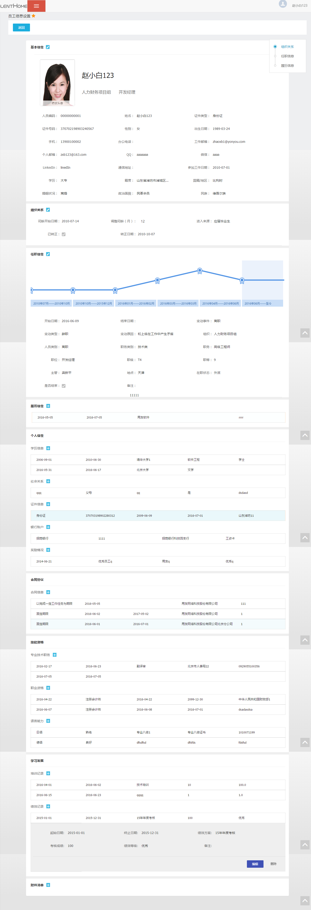


#### 人员节点后端开发 ####

通过controller.js的业务逻辑控制，设置模板信息、数据等相关参数，通过ajax请求后端服务处理相关的查询、保存、删除等功能，在后端服务保存过程中调用iuap.uitemplate.translate.impl.TranslateDataServiceImpl接口服务中的translateEntityToJSONByTemplate、translateEntitysToJSON等方法处理实体转json、json转实体，注：TranslateDataServiceImpl已经配置成服务(@Service)


#### 参照注册和使用 ####

首先需要将参照的基本信息注册到ref_refinfo数据库表里，拿人员类别参照举例：
参照编码refcode为psncl_ref，参照名称refname为人员类别，rest服务url为
/uitemplate_web/psncl_ref/ ，业务对象pk为42c223a8，其他字段可以为空，运行时可以调用参照SDK中接口类IUIrefService.java里面的addSaveRefModel方法，将此条数据插入到ref_refinfo表中，此表里面的数据会根据业务对象的pk去查询（md_entitypk字段），如果md_entitypk字段没有数据，那么会查询此表里所有的参照注册数据，如下表所示：

<table>
  <tr>
    <th>pk_ref</th>
    <th>refname</th>
    <th>refcode</th>
    <th>refclass</th>
    <th>refurl</th>
    <th>md_entitypk</th>
    <th>productType</th>
  </tr>
  <tr>
    <td>b6779b</td>
    <td>人员类别</td>
    <td>psncl_ref</td>
    <td></td>
    <td>/uitemplate_web/psncl_ref/</td>
    <td>42c223a8</td>
    <td>hr</td>
  </tr>
</table>


其次在UI模板设计器参照控件属性设置里列出查询出来的数据供选择人员类别参照；

参照后端运行时服务可以继承参照SDK提供的抽象类，直接实现里面的抽象方法即可，具体实现详细说明在参照组件的说明文档中。


###### 参照注册后台接口类是IUIrefService.java 里面方法有： ######

<table style="border-collapse:collapse">
    <tr>
        <th>方法名</th>
        <th>参数</th>
        <th>返回值</th>
        <th>功能说明</th>
    </tr>
    <tr>
        <td>queryRefModelByPK</td>
        <td>String md_entitypk（此参数是业务对象pk）</td>
        <td>List &ltUIrefEntity&gt（返回参照注册信息的列表）</td>
        <td>根据业务对象pk来获取参照注册信息列表</td>
    </tr>
    <tr>
        <td>queryRefModelByCode</td>
        <td>String refCode（此参数是参照的编码）</td>
        <td>UIrefEntity（返回参照注册信息的实体）</td>
        <td>根据refCode来获取参照注册信息实体</td>
    </tr>
    <tr>
        <td>addSaveRefModel</td>
        <td>UIrefEntity uiRefEntity（对应参照注册的实体信息）</td>
        <td>String（返回保存参照注册信息后的主键）</td>
        <td>用来返回保存参照注册信息后的主键</td>
    </tr>
    <tr>
        <td>updateSaveRefModel</td>
        <td>UIrefEntity uiRefEntity（对应参照注册的实体信息）</td>
        <td>void</td>
        <td>用来更新参照注册信息</td>
    </tr>
    <tr>
        <td>deleteRefModel</td>
        <td>String refCode（对应参照编码信息）</td>
        <td>void</td>
        <td>根据refCode用来删除参照注册信息</td>
    </tr>
</table>

#### 系统模板管理 ####

系统模板列表里面都是系统模板，是开发人员维护的，可以对模板进行编辑，删除，重命名，复制等操作，并且对控件类型的改变没有限制。
系统模板管理页面url访问地址：
http://服务器:端口号/uitemplate_web/uitemplate_ctr/uitemplate_design_ctr/manage##forms/write
打开后如下图所示：
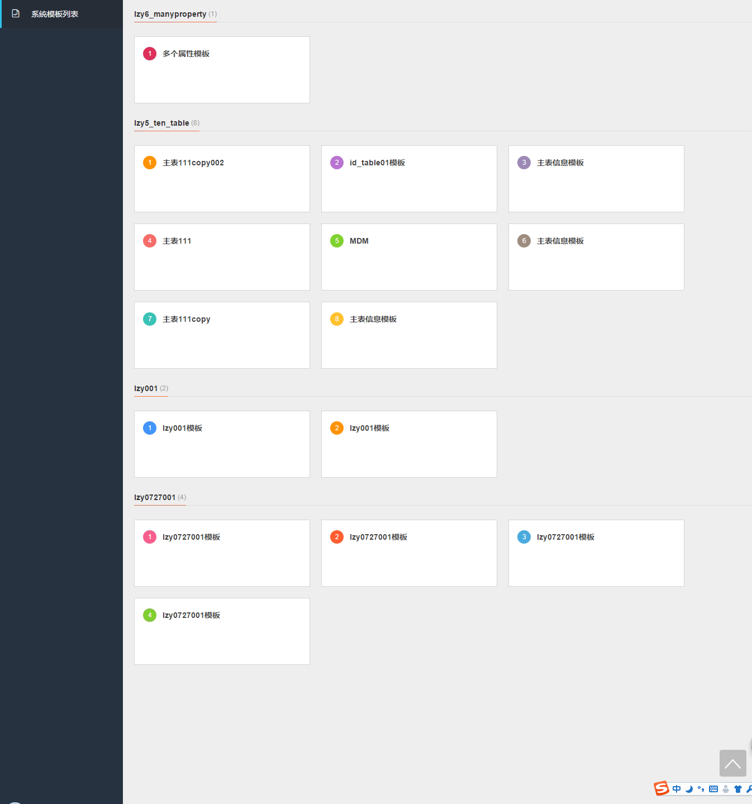

#### 租户模板定制 ####

租户模板是租户管理员维护的，里面分为 系统模板和租户模板，其中系统模板不会显示保存的按钮，即不能编辑，只能查看；而通过系统模板定制后的租户模板有保存按钮，可以编辑，但是租户模板不会让改变控件类型；除此之外还可以进行删除，重命名操作。
租户模板管理页面url访问地址：
http://服务器:端口号/uitemplate_web/uitemplate_ctr/uitemplate_design_ctr/manage##forms/usertempList
打开后如下图所示：


### 扩展机制 ###

包括模板编译扩展和运行期模板扩展

#### 模板编译扩展 ####

模板编译优先查找扩展目录下面的宏文件，如果没有找到则使用模板默认宏文件；
扩展目录在\WEB-INF\conf\uitemplate\uitemplate.properties中通过参数temp_macro_ext指定；配置方法请参照上文的模板集成配置说明；


#### 运行期模板扩展 ####
请参考上文的人员节点前端开发说明

### 主要模型和对象 ###

#### 模板模型表  uitemplate_temp ####

<table>
  <tr>
    <th>编码</th>
    <th>名称</th>
    <th>说明</th>
  </tr>
  <tr>
    <td>pk_temp</td>
    <td>模板主键</td>
    <td>模板模型主键</td>
  </tr>
   <tr>
    <td>tempform_name</td>
    <td>模板名称</td>
    <td>模板名称</td>
  </tr>
  <tr>
    <td>pk_metadata</td>
    <td>业务对象组件ID</td>
    <td>模板模型关联的业务对象组件</td>
  </tr>
   <tr>
    <td>jsontemp</td>
    <td>模板JSON模型</td>
    <td>描述模板布局和控件信息模型对象</td>
  </tr>
  <tr>
    <td>tenant_id</td>
    <td>租户id</td>
    <td>租户标识</td>
  </tr>
  <tr>
    <td>sys_pk_temp</td>
    <td>系统模板标识</td>
    <td>租户模板引用的系统模板标识</td>
  </tr>
  <tr>
    <td>cts</td>
    <td>模板创建时间</td>
    <td>模板创建时间</td>
  </tr>
  <tr>
    <td>uts</td>
    <td>模板更新时间</td>
    <td>模板更新时间</td>
  </tr>
</table>  

#### 系统模板关系表 uitemplate_nexus_base ####

<table>
  <tr>
    <th>编码</th>
    <th>名称</th>
    <th>说明</th>
  </tr>
  <tr>
    <td>pk_nexus</td>
    <td>系统模板关系主键</td>
    <td>系统模板关系标识</td>
  </tr>
  <tr>
    <td>pk_temp</td>
    <td>系统模板主键</td>
    <td>系统模板标识</td>
  </tr>
  <tr>
    <td>nexuskey</td>
    <td>系统模板别名</td>
    <td>系统模板别名标识</td>
  </tr>
  <tr>
    <td>funnode</td>
    <td>节点功能号</td>
    <td>节点功能号标识</td>
  </tr>
   <tr>
    <td>pk_country</td>
    <td>国家地区标识</td>
    <td>标识当前模板可以在哪些国家地区使用</td>
  </tr>
  <tr>
    <td>pk_industry</td>
    <td>行业标识</td>
    <td>标识当前模板可以在哪些行业使用</td>
  </tr>
  <tr>
    <td>layer</td>
    <td>研发层次</td>
    <td>标识当前模板的研发层次</td>
  </tr>
  <tr>
    <td>moduleid</td>
    <td>模块</td>
    <td>标识当前模板的模块</td>
  </tr>
  <tr>
    <td>ts</td>
    <td>系统关系更新时间</td>
    <td>系统关系更新时间</td>
  </tr>
</table>
  
#### 租户模板关系表 uitemplate_nexus ####

<table>
  <tr>
    <th>编码</th>
    <th>名称</th>
    <th>说明</th>
  </tr>
  <tr>
    <td>pk_nexus</td>
    <td>模板关系主键</td>
    <td>模板关系标识</td>
  </tr>
  <tr>
    <td>pk_temp</td>
    <td>租户模板主键</td>
    <td>租户模板标识</td>
  </tr>
  <tr>
    <td>nexuskey</td>
    <td>模板别名</td>
    <td>模板别名标识</td>
  </tr>
  <tr>
    <td>funnode</td>
    <td>节点功能号</td>
    <td>节点功能号标识</td>
  </tr>
   <tr>
    <td>sysflag</td>
    <td>是否系统模板关系标识</td>
    <td>Y或者N，缺省是N</td>
  </tr>
  <tr>
    <td>isdefault</td>
    <td>是否启用</td>
    <td>Y或者N，缺省是N</td>
  </tr>
  <tr>
    <td>tenant_id</td>
    <td>租户主键</td>
    <td>租户标识</td>
  </tr>
  <tr>
    <td>moduleid</td>
    <td>模块</td>
    <td>标识当前模板的模块</td>
  </tr>
  <tr>
    <td>ts</td>
    <td>模板关系更新时间</td>
    <td>模板关系更新时间</td>
  </tr>
</table>

#### 参照注册表 uitemplate_nexus ####

<table>
        <tr>
         <td>编码</td>
         <td>名称</td>
         <td>说明</td>
       </tr>
      <tr>
        <td>pk_ref</td>
        <td>参照主键</td>
        <td>参照标识</td>
      </tr>
       <tr>
        <td>refname</td>
        <td>参照名称</td>
        <td>参照名称</td>
      </tr>
       <tr>
        <td>refcode</td>
        <td>参照编码</td>
        <td>参照编码，设计器选择参照时的依据</td>
      </tr>
      <tr>
        <td>refclass</td>
        <td>参照实现类</td>
        <td>参照业务实现类，需要和参照的运行时集中部署</td>
      </tr>
      <tr>
        <td>refurl</td>
        <td>参照REST服务实现地址</td>
        <td>参照业务服务实现地址，不需要和参照的运行时集中部署</td>
      </tr>
      <tr>
        <td>md_entitypk</td>
        <td>参照对应的业务对象类型</td>
        <td>标识参照对应的业务实体</td>
      </tr>
      <tr>
        <td>productType</td>
        <td>产品类型</td>
        <td>标识参照的提供方</td>
      </tr>
</table>


#### 模板模型对象  tempjson ####
```
{
    "form": {
        "temptype": "hr", 
        "pk_temp": "dedb376d-44e9-49a7-96f6-4d2fd25728f2", 
        "pkMetadata": "05abcdf6-01bc-4a0f-b15c-eec52c6ba326", 
        "name": "人员基本信息模板", 
        "describe": "人员信息节点显示详细信息专用模板",
        "sysflag": "Y" 
    },
    "formLayout": { 
        "layoutType": "pc", 
        "layoutDetail": { 
            "componentKey": "ColumnPanel", 
            "title": "",
            "layoutDetail": [{
                "componentKey": "Label",
                "borderColor": "",
                "title": "人员专业技术职务",
                "isDisplay": true,
                "order": 1
            },
            {
                "componentKey": "form",
                "layoutDetail": [{
                    "coordinate": "0_0",
                    "rowSpan": 1,
                    "colSpan": 1,
                    "width": 253,
                    "height": 71,
                    "componentKey": "TdLayout",
                    "layoutDetail": [{
                        "componentKey": "DateComponent",
                        "title": "评定日期",
                        "titleLayout": "",
                        "order": 2,
                        "index": 0,
                        "describe": "",
                        "required": false,
                        "islist": false,
                        "fieldId": "20160518110551M1gRYcnYxv",
                        "format": "YYYY-MM-DD",
                        "isSystemDate": false,
                        "borderColor": "",
                        "isReadonly": false,
                        "itemId": "1e601331-3993-434c-ae1e-d24bbed1a13a",
                        "itemCode": "staff.staff_techpost.begindate",
                        "isDisplay": true,
                        "isbusinessObj": false,
                        "itemKey": "8af8008a-0202-4888-b905-a81e0083ba0a",
                        "isNeedSerialize": true
                    }]
                },
                {
                    "coordinate": "0_1",
                    "rowSpan": 1,
                    "colSpan": 1,
                    "width": 253,
                    "height": 71,
                    "componentKey": "TdLayout",
                    "layoutDetail": [{
                        "componentKey": "DateComponent",
                        "title": "终止日期",
                        "titleLayout": "",
                        "order": 2,
                        "index": 0,
                        "describe": "",
                        "required": false,
                        "islist": false,
                        "fieldId": "20160518110551KrVHgLBfF4",
                        "format": "YYYY-MM-DD",
                        "isSystemDate": false,
                        "borderColor": "",
                        "isReadonly": false,
                        "itemId": "49fc5d9b-9314-4dc0-b7a8-ec046eede38d",
                        "itemCode": "staff.staff_techpost.enddate",
                        "isDisplay": true,
                        "isbusinessObj": false,
                        "itemKey": "d892a381-0121-4f14-bd74-17740518a38d",
                        "isNeedSerialize": true
                    }]
                },
                {
                    "coordinate": "0_2",
                    "rowSpan": 1,
                    "colSpan": 1,
                    "width": 253,
                    "height": 71,
                    "componentKey": "TdLayout",
                    "layoutDetail": [{
                        "componentKey": "Reference",
                        "title": "获得职称",
                        "titleLayout": "",
                        "order": 2,
                        "index": 0,
                        "describe": "",
                        "required": false,
                        "fieldId": "2016051811055163erCxlCI5",
                        "size": "large",
                        "isMutiSelect": false,
                        "borderColor": "",
                        "contMeta": "",
                        "islist": false,
                        "pkMd": "",
                        "itemId": "106a3efe-b80b-448f-bac8-d903a429aad6",
                        "itemCode": "staff.staff_techpost.title",
                        "isDisplay": true,
                        "isbusinessObj": false,
                        "itemKey": "2658275c-12c8-4e92-b639-f7fba0c6d93b",
                        "entityId": "2658275c-12c8-4e92-b639-f7fba0c6d93b",
                        "isNeedSerialize": true
                    }]
                },
                {
                    "coordinate": "1_0",
                    "rowSpan": 1,
                    "colSpan": 1,
                    "width": 253,
                    "height": 71,
                    "componentKey": "TdLayout",
                    "layoutDetail": [{
                        "componentKey": "Text",
                        "title": "评定机构",
                        "titleLayout": "",
                        "order": 2,
                        "index": 0,
                        "describe": "",
                        "required": false,
                        "fieldId": "20160518110551lLE8yDevFR",
                        "size": "large",
                        "borderColor": "",
                        "width": "",
                        "height": "",
                        "islist": false,
                        "itemId": "46fd80d9-4ccc-40f8-97d0-21d4a77f4306",
                        "itemCode": "staff.staff_techpost.ratingorg",
                        "isDisplay": true,
                        "isbusinessObj": false,
                        "itemKey": "d2b95a23-a92a-407e-9194-d4ed33daf8a6",
                        "formula": "",
                        "isNeedSerialize": true
                    }]
                },
                {
                    "coordinate": "1_1",
                    "rowSpan": 1,
                    "colSpan": 1,
                    "width": 253,
                    "height": 71,
                    "componentKey": "TdLayout",
                    "layoutDetail": [{
                        "componentKey": "Text",
                        "title": "取得途径",
                        "titleLayout": "",
                        "order": 2,
                        "index": 0,
                        "describe": "",
                        "required": false,
                        "fieldId": "20160518110551hM7abUxAt8",
                        "size": "large",
                        "borderColor": "",
                        "width": "",
                        "height": "",
                        "islist": false,
                        "itemId": "3375926c-10a7-4d7a-9e36-a7cb27af9a70",
                        "itemCode": "staff.staff_techpost.channel",
                        "isDisplay": true,
                        "isbusinessObj": false,
                        "itemKey": "2513ebd1-f184-4f73-bfa4-7837a6d69973",
                        "formula": "",
                        "isNeedSerialize": true
                    }]
                },
                {
                    "coordinate": "1_2",
                    "rowSpan": 1,
                    "colSpan": 1,
                    "width": 253,
                    "height": 71,
                    "componentKey": "TdLayout",
                    "layoutDetail": [{
                        "componentKey": "Text",
                        "title": "证书编码",
                        "titleLayout": "",
                        "order": 2,
                        "index": 0,
                        "describe": "",
                        "required": false,
                        "fieldId": "20160518110551iUcFwrmjpU",
                        "size": "large",
                        "borderColor": "",
                        "width": "",
                        "height": "",
                        "islist": false,
                        "itemId": "d5d967c3-0557-4625-a781-e3024c9c7e21",
                        "itemCode": "staff.staff_techpost.certno",
                        "isDisplay": true,
                        "isbusinessObj": false,
                        "itemKey": "52de2a21-637e-4e7b-a06e-92c2be48c835",
                        "formula": "",
                        "isNeedSerialize": true
                    }]
                },
                {
                    "coordinate": "2_0",
                    "rowSpan": 1,
                    "colSpan": 1,
                    "width": 253,
                    "height": 71,
                    "componentKey": "TdLayout",
                    "layoutDetail": [{
                        "componentKey": "TextArea",
                        "title": "备注",
                        "titleLayout": "",
                        "order": 2,
                        "index": 0,
                        "describe": "",
                        "required": false,
                        "fieldId": "20160518110551s9tqae8SaE",
                        "borderColor": "",
                        "size": "large",
                        "islist": false,
                        "itemId": "4befc283-30ad-451d-87f0-3eda3d99fa39",
                        "itemCode": "staff.staff_techpost.memo",
                        "isDisplay": true,
                        "isbusinessObj": false,
                        "itemKey": "67247b34-4b1e-4ae6-8d5c-c0c75395e111",
                        "isNeedSerialize": true
                    }]
                },
                {
                    "coordinate": "2_1",
                    "rowSpan": 1,
                    "colSpan": 1,
                    "width": 253,
                    "height": 71,
                    "componentKey": "TdLayout",
                    "layoutDetail": [{
                        "componentKey": "Text",
                        "title": "人员子表主键",
                        "titleLayout": "",
                        "order": 2,
                        "index": 0,
                        "describe": "",
                        "required": false,
                        "fieldId": "20160518110551MguMM4khCf",
                        "size": "large",
                        "borderColor": "",
                        "width": "",
                        "height": "",
                        "islist": false,
                        "itemId": "7c1035b5-70ce-4f4a-89cf-793e79beb61a",
                        "itemCode": "staff.staff_techpost.id",
                        "isDisplay": true,
                        "isbusinessObj": false,
                        "itemKey": "a256fab5-51ed-4e49-bd52-05610ac43fd1",
                        "formula": "",
                        "isNeedSerialize": true
                    }]
                },
                {
                    "coordinate": "2_2",
                    "rowSpan": 1,
                    "colSpan": 1,
                    "width": 253,
                    "height": 71,
                    "componentKey": "TdLayout",
                    "layoutDetail": [{
                        "componentKey": "Text",
                        "title": "业务单元",
                        "titleLayout": "",
                        "order": 2,
                        "index": 0,
                        "describe": "",
                        "required": false,
                        "fieldId": "20160518110551SFl0t3NNk7",
                        "size": "large",
                        "borderColor": "",
                        "width": "",
                        "height": "",
                        "islist": false,
                        "itemId": "630937d9-4e94-4eb4-b3ea-1cd7f7b027a7",
                        "itemCode": "staff.staff_techpost.bu_id",
                        "isDisplay": true,
                        "isbusinessObj": false,
                        "itemKey": "d5d371c9-d771-4da6-adca-bf372f60bf20",
                        "formula": "",
                        "isNeedSerialize": true
                    }]
                },
                {
                    "coordinate": "3_0",
                    "rowSpan": 1,
                    "colSpan": 1,
                    "width": 253,
                    "height": 71,
                    "componentKey": "TdLayout",
                    "layoutDetail": [{
                        "componentKey": "NumberComponent",
                        "title": "记录序号",
                        "titleLayout": "field-vertical",
                        "order": 2,
                        "index": 0,
                        "describe": "",
                        "required": false,
                        "fieldId": "20160518110551VExuQxUIBd",
                        "size": "large",
                        "decimalPlace": 0,
                        "calculate": false,
                        "isEdit": true,
                        "isTotal": false,
                        "mainTableField": "",
                        "calculationFormula": "",
                        "borderColor": "",
                        "inDataTable": "",
                        "numberFields": [],
                        "numberFieldArr": [],
                        "tempId": 0,
                        "islist": false,
                        "itemId": "f265eead-aa7a-4dc0-97d0-e06b4da335b8",
                        "itemCode": "staff.staff_techpost.recordnum",
                        "isDisplay": true,
                        "isbusinessObj": false,
                        "itemKey": "559c127b-47fa-4392-ab73-f0baf58948c6",
                        "isNeedSerialize": true
                    }]
                }]
            }],
            "order": 0,
            "index": 0,
            "size": "1",
            "required": false
        }
    }
}

```


